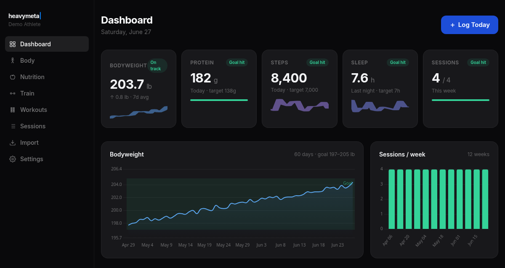
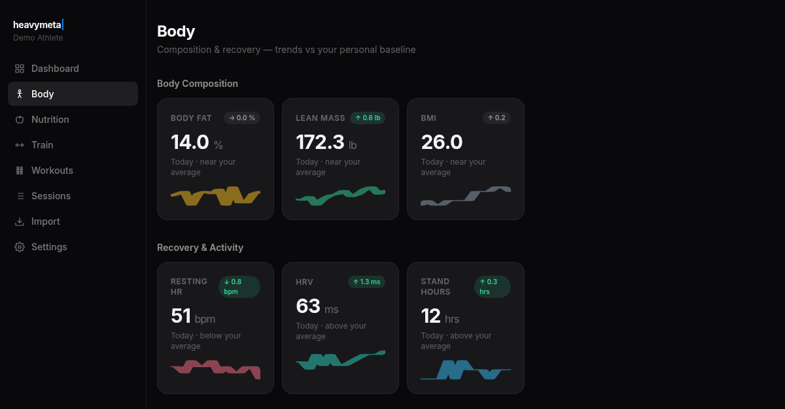
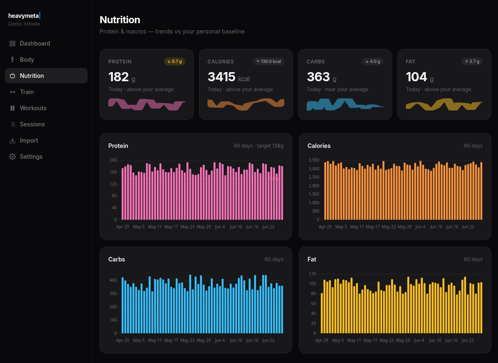
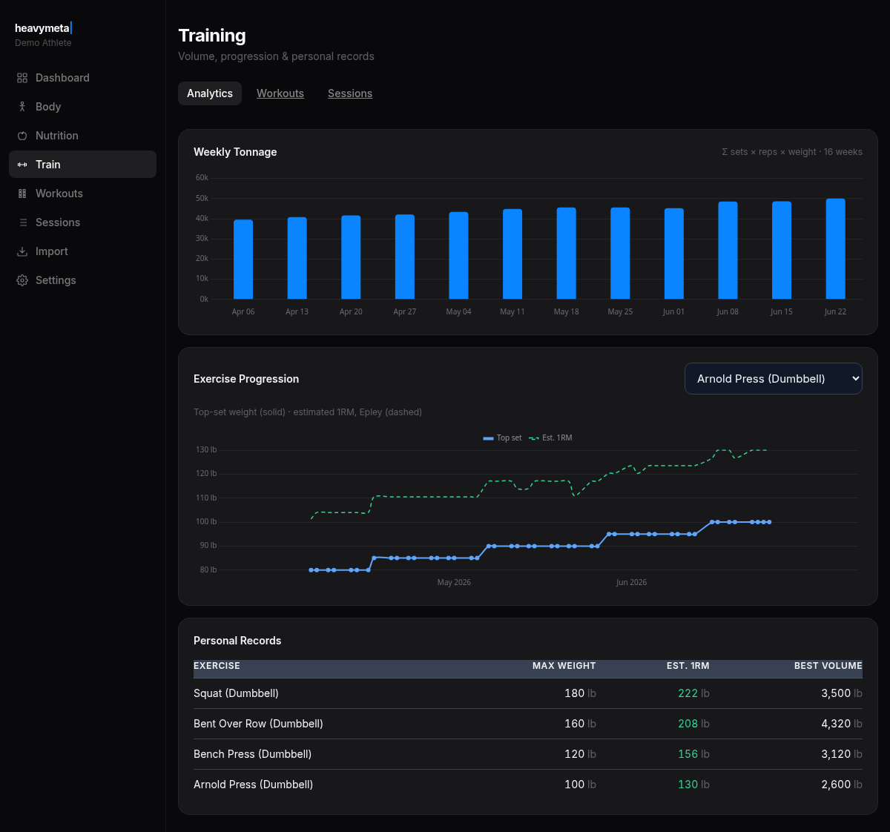
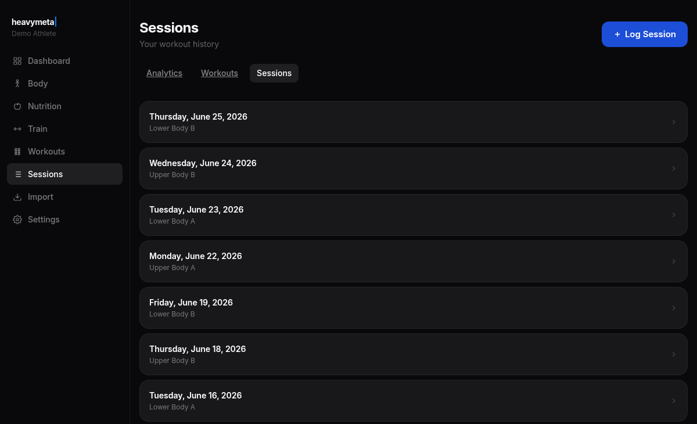
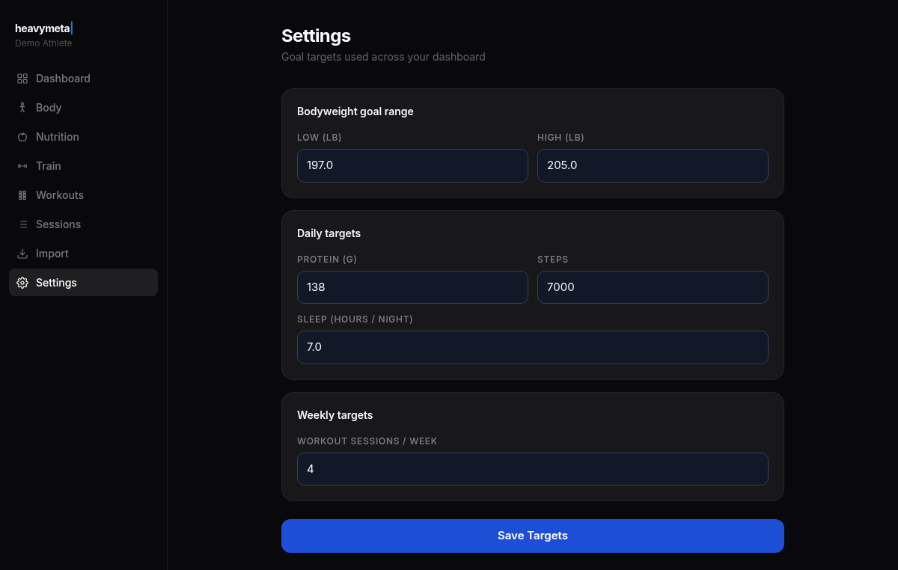
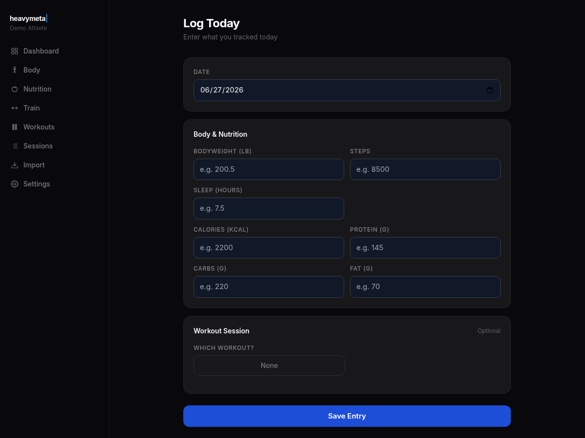
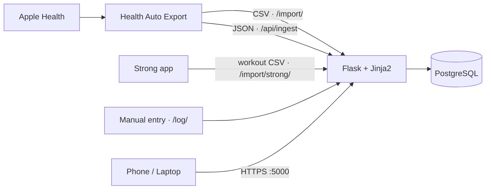
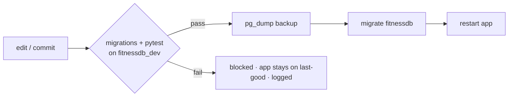

#  <picture><source media="(prefers-color-scheme: dark)" srcset="docs/brand/wordmark-dark.svg"></picture>

[](https://github.com/brianhelfrich/heavymeta_/actions/workflows/ci.yml)


A self-hosted, single-user fitness dashboard — Apple Health, Strong, and MacrosFirst data
pulled into one place and tracked against goals, served from a box at home to any device
on the network.



<sub>Screenshots use seeded demo data, not real numbers.</sub>

## Highlights

- **Validated dev→prod pipeline.** Every commit *and* every hot-reload runs migrations + the
  test suite against a snapshot database (`fitnessdb_dev`); changes reach the live app and the
  prod schema only on a clean pass — and a `pg_dump` backup is taken before any migration
  auto-applies. → [`bin/gate.sh`](bin/gate.sh)
- **Four idempotent ingestion paths.** Manual form, Health Auto Export CSV, a
  **token-gated JSON API** for hands-free HAE automation, and a **Strong workout-CSV importer** —
  all converging on a single upsert, so re-imports never duplicate.
- **CI on every push.** GitHub Actions stands up Postgres 18 and runs the full gauntlet:
  `ruff` lint + format, `mypy`, `pip-audit`, a **from-scratch migration build** (`flask db upgrade` on
  an empty DB) + drift check (`flask db check`), and the `pytest` suite gated at a **90% coverage floor**.
  Transaction-rollback isolation keeps tests off real data.
- **Always-on + auto-deploy.** Runs as a `systemd` service over HTTPS; a file-watcher rebuilds
  CSS and redeploys on save — gated by the tests, so a broken edit never ships.
- **Recency-aware analytics.** The dashboard distinguishes *today* from *stale* data, so a
  tracking gap can't masquerade as current.

## Screenshots

The dashboard is a glanceable overview; each domain drills into its own page.

| Body | Nutrition | Training |
|:---:|:---:|:---:|
| [](docs/screenshots/body.png) | [](docs/screenshots/nutrition.png) | [](docs/screenshots/training.png) |

| Workout history | Goal settings | Daily log |
|:---:|:---:|:---:|
| [](docs/screenshots/sessions.png) | [](docs/screenshots/settings.png) | [](docs/screenshots/log.png) |

## Architecture

Multiple sources, one upsert, one source of truth:



Every change is validated on a snapshot DB before it can reach the live app or prod schema:



Design rationale and the deploy pipeline in detail → **[docs/DESIGN.md](docs/DESIGN.md)**.

## What it tracks

Each metric is a goal-tracked, recency-aware stat card on the dashboard — a reading
older than a couple of days is flagged *Stale* rather than reported as current, so
goal status is only judged on fresh data.

| Metric | Goal | Source |
|--------|------|--------|
| Bodyweight | 197–205 lb (7-day avg) | Manual / Health Auto Export |
| Protein | ≥ 138 g/day | Manual / MacrosFirst via Health |
| Steps | ≥ 7,000/day | Apple Health via Health Auto Export |
| Workout sessions | ≥ 4×/week | Manual log in app |
| Sleep | ≥ 7 h/night | Apple Health via Health Auto Export |

Goals are user-configurable at `/settings/`. Charts render client-side with Chart.js (MIT).
Body composition, nutrition, and training each get their own page, framed as trends against a
personal baseline.

## Stack

| Layer | Technology |
|-------|-----------|
| Language / framework | Python 3.14 · Flask 3.x |
| Data | PostgreSQL · SQLAlchemy · Alembic (Flask-Migrate) |
| Frontend | Jinja2 server-rendered · Tailwind v4 · Chart.js (MIT) |
| Security | Headers middleware — CSP with per-request script nonces, HSTS, + 5 standard hardening headers |

## Quickstart

```bash
git clone git@github.com:brianhelfrich/heavymeta_.git && cd heavymeta_
python3 -m venv venv && source venv/bin/activate
pip install -r requirements.txt
cp .env.example .env                       # set FITNESS_DB_URL and SECRET_KEY
./bin/tailwindcss -i frontend/static/css/style.css -o frontend/static/css/output.css
flask --app backend:create_app db upgrade
flask --app backend:create_app run --debug --port 5000
```

Full setup (vendored assets, SSL, project layout, schema, testing) →
**[docs/SETUP.md](docs/SETUP.md)**. Always-on deployment → **[deploy/README.md](deploy/README.md)**.

## Getting data in

Three ways, all landing in the `measurements` table via one idempotent upsert:

1. **Manual** — the `/log/` daily entry form.
2. **CSV import** — `/import/` accepts a Health Auto Export CSV (one-off bulk load).
3. **Automated** — `/api/ingest` accepts HAE's REST automation (token-gated JSON `POST`,
   hands-free). Set `INGEST_TOKEN`, point an HAE *REST API* automation at
   `https://<host>:5000/api/ingest` with header `X-Ingest-Token: <token>`.

## Testing

```bash
TEST_DATABASE_URL="${FITNESS_DB_URL%/*}/fitnessdb_dev" python -m pytest
```

Transaction-rollback isolation means tests never mutate the snapshot DB — even routes
that `commit()`. The same suite gates both commits (pre-commit hook) and deploys
(file-watcher); CI adds a 90% coverage floor (the local gate is stricter, at 92%), `mypy`,
`pip-audit`, and a from-scratch migration check. Details in [docs/SETUP.md](docs/SETUP.md#testing--the-quality-gate).

## Shipped

- **Automated Apple Health ingestion** — a token-gated REST API (`/api/ingest`)
  pulling from Health Auto Export on a schedule, plus one-off CSV bulk import.
  Dupe-proof writes via an atomic `INSERT … ON CONFLICT` upsert behind a unique
  constraint.
- **Dashboard & logging** — dark-mode analytics dashboard, manual daily log,
  workout browser and session history, user-configurable goals.
- **Category analytics pages** — Body (composition + recovery), Nutrition
  (protein + macros), and Training (per-exercise progression with estimated 1RM,
  weekly tonnage, personal records). The dashboard is now a glanceable overview
  that drills into each domain; deeper history lives on per-metric detail pages.
- **Typed, checked codebase** — SQLAlchemy 2.0 `Mapped[]` models and a fully
  typed, strict-checked ingest core.
- **Quality gate & CI** — `ruff`, `mypy`, `pip-audit`, and `pytest` (90 % CI
  coverage floor, 92 % locally) on every push, plus a from-scratch migration build.
- **Hardened delivery** — CSP with per-request script nonces (no `'unsafe-inline'`
  for scripts) and cache-busted, immutably-cached static assets.
- **Operations** — always-on HTTPS systemd service with self-healing units; a
  gated dev→prod deploy that ships only a clean committed snapshot, with automatic
  `pg_dump` backups and `SECRET_KEY` fail-fast in prod.

## Backlog

- DR Test: Verify `pg_dump` backup → restore path and add a scripted, repeatable restore drill
- CSS: Scope the global prose-link styles (`html.dark a`) to content only — silently outranked the nav's active-state colors once already
- Accessibility: redundant non-color cues on the status pills and trend chips; OpenGraph & Twitter card compatibility
- Trend Analysis over Time: Measurements/Body-comp; review consistency streaks derivable from `measurements` dataset
- Periodic audit of new/stale metric types
