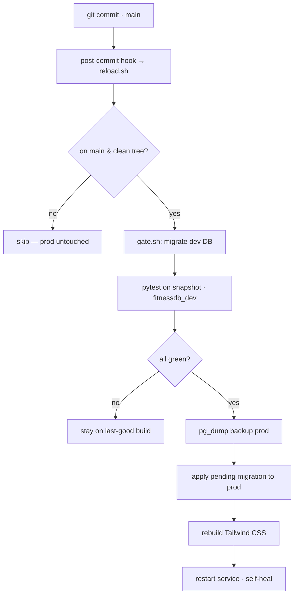

# Design notes

Why Heavy Metal is built the way it is — the non-obvious decisions behind its two
goals: **getting data in reliably** and **shipping changes safely**. The overview
diagrams live in the [README](../README.md#architecture); this page is the detail and
the rationale.

## The deploy pipeline

Every commit on `main` auto-deploys — but only a clean, tested snapshot ever reaches
the live app or the prod schema, and prod is backed up before any migration applies.

The same gate runs from the pre-commit hook and the file-watcher, so the path to prod
is identical whether a change lands by commit or by save.

## Engineering decisions

### Idempotent ingestion by construction
All three writers funnel through one atomic `INSERT … ON CONFLICT` on `(user, date,
type, unit)`, so a retried API post or a re-run CSV updates in place instead of
duplicating. Dedupe is a database invariant, not application bookkeeping.
→ [`measurements.py`](../backend/measurements.py)

### Migrations proven from scratch, every push
CI rebuilds the whole migration chain on an empty Postgres and runs `flask db check` for
type and server-default drift — "works on my dev DB" isn't "builds from nothing."
Baseline squashed; prod drift reconciled (12 legacy server-defaults declared).

### Backup before auto-migrate
Commits auto-deploy, so a bad migration would hit prod unattended — the gate `pg_dump`s
prod before applying any pending migration. → [`gate.sh`](../bin/gate.sh)

### `SECRET_KEY` fail-fast at the serving boundary
The prod `SECRET_KEY` check lives in [`run.py`](../run.py), not `create_app` — the CLI,
Alembic, CI, and tests all build the app keyless and must not trip it. The guard sits
exactly where the app is served, and nowhere else.

### CSP with per-request script nonces
Inline scripts are gated by a nonce minted per response (not `unsafe-inline`), and static
URLs are versioned for immutable caching. → [`security.py`](../backend/security.py)
